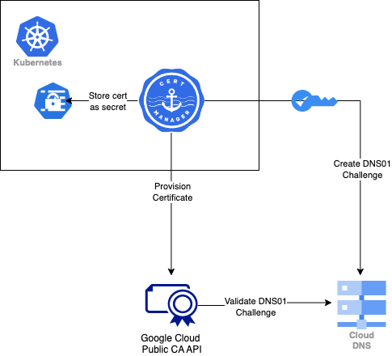

# Use GCP Public CA with Kubernetes Certificate Manager

## Design


## Instructions

### install cert-manger in your cluster
```shell
kubectl apply -f https://github.com/cert-manager/cert-manager/releases/download/v1.11.0/cert-manager.yaml
```

### Request an EAB key ID and HMAC using GCP Public CA

Enable the API:
```shell
gcloud services enable publicca.googleapis.com
```

(Optional) Use staging environment:
```
gcloud config set api_endpoint_overrides/publicca https://preprod-publicca.googleapis.com/
```

Create keys
```shell
gcloud beta publicca external-account-keys create
```
Sample output:
```shell
Created an external account key
[b64MacKey: ********
keyId: ******]
```

### store EAB secret in k8s
```shell
kubectl create secret generic eab_secret --from-literal secret=<eab_hmac> -n cert-manager
```

### Confirm ACME directory URL based on your public CA environment

Refer to [here](https://cloud.google.com/certificate-manager/docs/public-ca-tutorial#register-acme) and note down the URL for next step. 

### Compose Issuer configuration

There are 3 configurations to modify:
- spec.acme.externalAccountBinding.keyID: they HMAC key ID
- spec.acme.server: ACME directory URL from last step
- spec.acme.solvers["dns01"].cloudDNS.project: Your GCP project ID that hosts public DNS records

```yaml
apiVersion: cert-manager.io/v1
kind: ClusterIssuer
metadata:
  name: gcppublic
  namespace: cert-manager
spec:
  acme:
    email: xxxx@xxx.com
    #New enrolments only
    server: <directory URL>
    externalAccountBinding:
      keyID: <HMAC Key>
      keySecretRef:
        name: eab-secret
        key: secret
    privateKeySecretRef:
        name: example-issuer-account-key
    solvers:
    - dns01:
        cloudDNS:
          # The ID of the GCP project
          project: <DNS_PROJECT_ID>
```


### configure kubernetes service account iam for cert-manager

Create a service account in your DNS project (done by terraform)

Configure Workload Identity for cert-manager service account for DNS challenge
```
kubectl annotate serviceaccount --namespace=cert-manager cert-manager \
    "iam.gke.io/gcp-service-account=dns01-solver@$DNS_PROJECT_ID.iam.gserviceaccount.com"
```

### Create a cert using the issuer
```yaml
apiVersion: cert-manager.io/v1
kind: Certificate
metadata:
  name: example-com
  namespace: demo
spec:
  secretName: example-com-tls
  issuerRef:
    # The issuer created previously
    name: gcppublic
    kind: ClusterIssuer
  dnsNames:
  - cert-demo.example.com
```